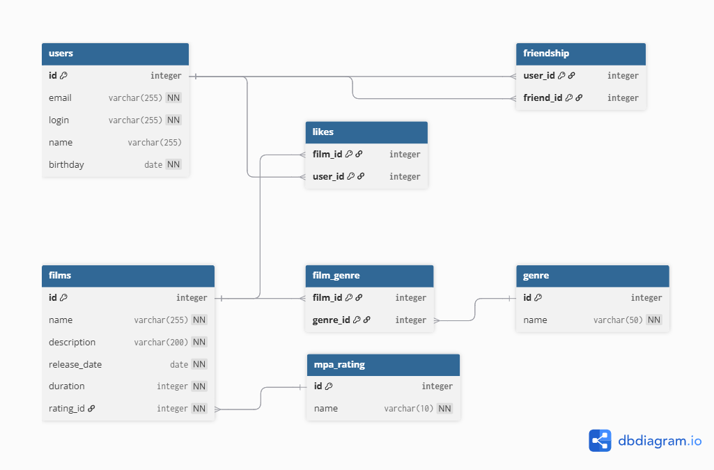

# Схема базы данных для сервиса Filmorate

Этот документ описывает схему базы данных для приложения Filmorate.

## ER-диаграмма

На диаграмме ниже представлены все таблицы базы данных и связи между ними.



## Описание сущностей

*   `users`: Хранит информацию о пользователях.
*   `friendship`: Связывает пользователей для реализации "дружбы".
*   `films`: Хранит информацию о фильмах.
*   `mpa_rating`: Справочник возрастных рейтингов (G, PG-13 и т.д.).
*   `genre`: Справочник жанров (Комедия, Драма и т.д.).
*   `film_genre`: Связывает фильмы с их жанрами.
*   `likes`: Хранит информацию о лайках, которые пользователи поставили фильмам.

## Примеры простых SQL-запросов

1.  **Добавление нового пользователя**

    Этот запрос регистрирует в системе нового пользователя.

    ```sql
    INSERT INTO users (email, login, name, birthday)
    VALUES ('new_user@example.com', 'new_login', 'New Username', '1990-01-15');
    ```

2.  **Пользователь ставит лайк фильму**

    Этот запрос добавляет запись о том, что пользователь с `ID=1` поставил лайк фильму с `ID=5`.

    ```sql
    INSERT INTO likes (film_id, user_id)
    VALUES (5, 1);
    ```

3.  **Добавление нового фильма**

    Этот запрос добавляет в базу данных информацию о новом фильме.

    ```sql
    INSERT INTO films (name, description, release_date, duration, rating_id)
    VALUES ('Новый фильм', 'Захватывающее описание нового фильма.', '2023-10-26', 120, 3);
    ```
